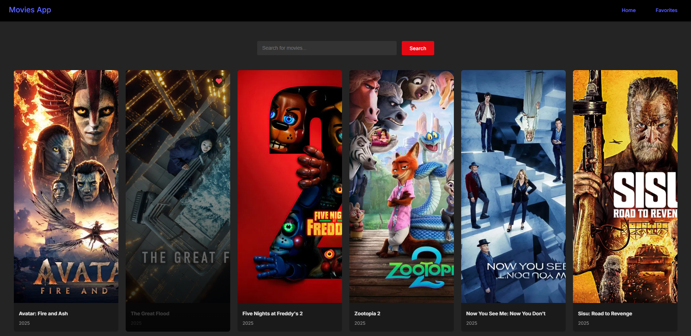
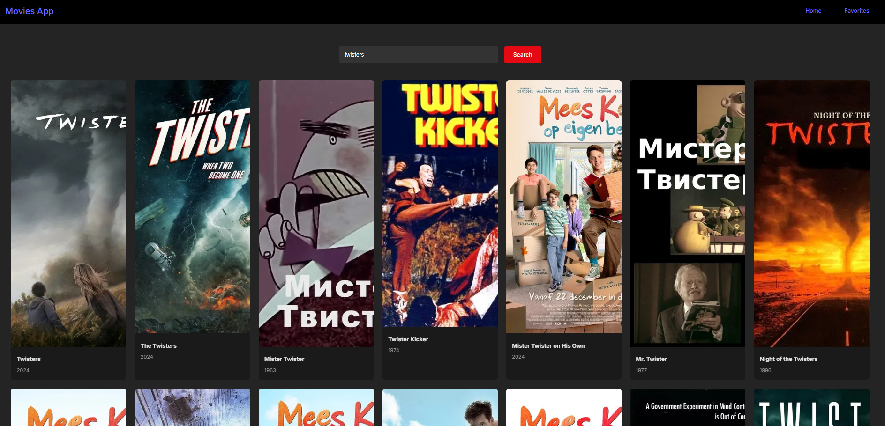
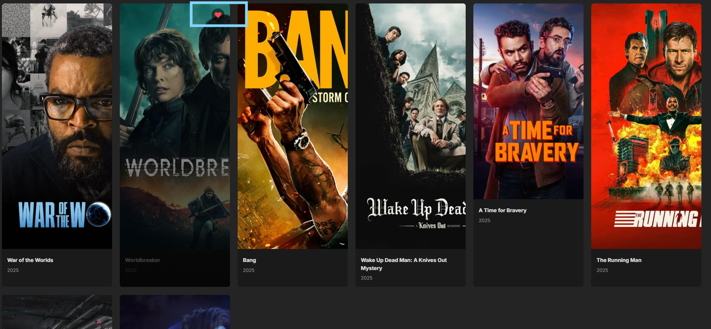
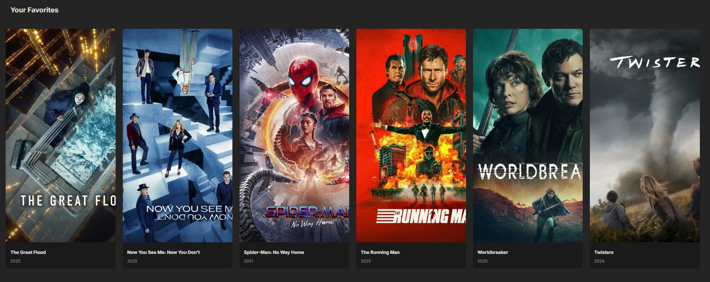

# Movie App - React Movie Web App

A responsive movie application built with **React** and the **TMDB API**. This project allows users to browse popular movies, search for specific titles, and manage their personal favorites.

---

## Previews

### Home Page
Check out the popular movies.

---

### Search Feature
Search whatever movie you want to find.

---

### Favorite Feature
Add movies to favorite. This uses browsers localStorage to store favorited movies.

---

### Favorites Page
A page to view all your favorited movies.

---

## Features
* **Live TMDB Data:** Fetches real-time movie data using REST API.
* **Dynamic Search:** Instant search results with error handling.
* **Responsive Grid:** Fully responsive layout for mobile, tablet, and desktop
* **Error Boundaries:** Graceful handling of API and network failures.

##  Tech Stack
* **Frontend:** React (Vite)
* **Styling:** CSS
* **API:** TMDB (The Movie Database)
